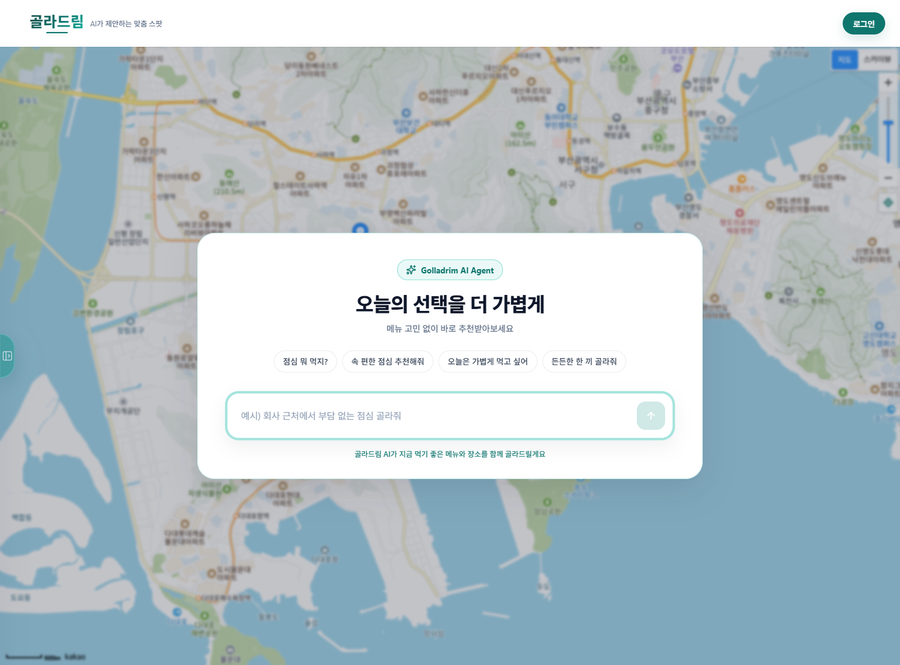

# Golladrim

> "뭐 먹지?"라는 짧은 질문에서 시작해, 메뉴 선택부터 장소 추천까지 이어지는 AI 기반 Recommendation Flow Platform

<p align="center">
  
</p>


---

## 프로젝트 개요

**Golladrim(골라드림)** 은 단순히 음식 메뉴 하나를 추천하는 서비스가 아니라, 사용자의 현재 상황과 취향, 대화 흐름을 바탕으로<br>`메뉴 -> 장소 -> 추천 근거`까지 연결하는 추천 흐름 플랫폼을 목표로 합니다.

많은 추천 서비스는 사용자가 이미 원하는 카테고리를 알고 있다는 전제에서 출발합니다. 하지만 실제 상황에서는<br>"배고픈데 뭘 먹어야 할지 모르겠다", "오늘은 가볍게 먹고 싶다", "근처에서 갈 만한 곳을 고르고 싶다"처럼 조건이 모호하게 시작되는 경우가 많습니다.

골라드림은 이 모호한 출발점을 대화형 추천 흐름으로 풀어내고, AI가 해석한 의도와 Rule 기반 필터링을 함께 사용해<br> 더 일관된 추천 경험을 만드는 것을 목표로 합니다.

---

## 문제 정의

일상적인 음식 선택은 단순 검색 문제라기보다 의사결정 문제에 가깝습니다.

| 기존 방식 | 한계 |
| --- | --- |
| 키워드 검색 | 사용자가 이미 원하는 메뉴나 장소를 알고 있어야 함 |
| 별점/리뷰 기반 추천 | 개인의 현재 상황, 동행, 날씨, 시간대 같은 맥락 반영이 약함 |
| 랜덤 메뉴 추천 | 재미는 있지만 추천 결과의 설득력과 재사용성이 낮음 |
| AI 단독 추천 | 응답은 자연스럽지만 위치, 운영 여부, 조건 필터링 같은 검증 가능한 로직이 약해질 수 있음 |

골라드림은 이 한계를 줄이기 위해 **AI의 자연어 이해 능력**과 **Rule 기반 추천 파이프라인**을 분리해 설계하고 있습니다.

---

## 핵심 목표

- 사용자의 모호한 표현을 추천 조건으로 구조화한다.
- 메뉴 추천과 장소 추천을 하나의 흐름으로 연결한다.
- AI가 모든 결정을 대신하기보다, 해석과 설명이 필요한 지점에 집중해서 사용한다.
- 인증, 사용자 선호, 추천 이력, 피드백을 확장 가능한 도메인 구조로 관리한다.
- 로컬 개발 환경을 Docker 기반으로 재현 가능하게 유지한다.

---

## 기술 스택

### Frontend

| 역할 | 기술 |
| --- | --- |
| App Framework |  |
| UI Runtime |  |
| Language |  |
| Server State |  |
| Client State |  |
| HTTP Client |  |
| Styling |  |

### Backend

| 역할 | 기술 |
| --- | --- |
| Language |  |
| Framework |  |
| Security |  |
| Persistence |  |
| Token Store |  |
| AI Extension |  |

### Database / Infra

| 역할 | 기술 |
| --- | --- |
| RDBMS |  |
| Container |  |

---

## 현재 진행 상태

### 구현 완료 / 진행 중

- Frontend 랜딩 UI 구조
- 채팅 패널 + 지도 패널 기반 추천 메인 레이아웃
- Kakao Map SDK 로딩 구조
- Backend 프로젝트 초기 세팅
- MariaDB + Redis Docker Compose 로컬 환경
- Google/Kakao OAuth2 로그인 흐름
- JWT Access Token / Refresh Token 발급 구조
- Refresh Token Redis 저장 및 TTL 기반 만료 관리
- HttpOnly Cookie 기반 토큰 전달 구조
- 사용자 정보 조회, 로그아웃, 닉네임 변경 API
- 관리자용 사용자 조회, 권한 변경, 정지/해제 API
- README 및 프로젝트 구조 정리

### Planned

- 자연어 기반 추천 요청 API
- 메뉴/장소 추천 도메인 모델링
- Rule 기반 추천 조건 추출 및 필터링
- AI 응답 생성 및 추천 근거 설명
- 사용자 선호도, 추천 이력, 피드백 저장
- ERD 정리
- Swagger/OpenAPI 문서화
- 배포 환경 구성

---

## 시스템 아키텍처

현재 구조는 `Frontend`, `Backend API`, `MariaDB`, `Redis`를 중심으로 구성되어 있습니다.<br>추천 기능은 향후 `Recommendation Domain`과 `AI/Rule Engine`을 별도 흐름으로 확장할 예정입니다.

```plaintext
┌─────────────────────────┐
│        Frontend         │
│ Next.js / React / TS    │
│ Chat UI + Map Layout    │
└───────────┬─────────────┘
            │
            │ HTTPS / Cookie / JSON
            ▼
┌─────────────────────────┐
│       Backend API       │
│ Spring Boot / Security  │
│ Auth / User / Recommend │
└───────┬─────────┬───────┘
        │         │
        │         │
        ▼         ▼
┌────────────┐  ┌────────────┐
│  MariaDB   │  │   Redis    │
│ User Data  │  │ Token TTL  │
│ Domain DB  │  │ Cache/Vec  │
└────────────┘  └────────────┘
```

### 설계 방향

- **Frontend**는 추천 경험을 채팅과 지도 중심으로 구성합니다.
- **Backend**는 인증, 사용자, 추천 도메인을 분리해 확장 가능한 API 계층으로 관리합니다.
- **MariaDB**는 사용자, 선호도, 추천 이력처럼 영속성이 필요한 데이터를 담당합니다.
- **Redis**는 Refresh Token, 캐시, 향후 벡터 검색 기반 확장 지점으로 사용합니다.

---

## 인증 흐름

골라드림의 인증 구조는 OAuth2 로그인 이후 자체 JWT를 발급하는 방식으로 설계되어 있습니다.

```plaintext
1. 사용자가 Google/Kakao OAuth2 로그인을 요청한다.
2. Spring Security OAuth2 Client가 Provider 인증을 처리한다.
3. OAuth2 사용자 정보를 조회하거나 신규 사용자를 생성한다.
4. Backend가 Access Token과 Refresh Token을 발급한다.
5. Token은 HttpOnly Cookie로 Frontend에 전달된다.
6. Refresh Token은 Redis에 저장하고 TTL로 만료 시간을 관리한다.
7. 이후 API 요청은 JWT 인증 필터를 통해 사용자 인증을 수행한다.
```

### OAuth2 + JWT를 선택한 이유

- OAuth2는 소셜 로그인 진입 장벽을 낮추고, 비밀번호 저장 책임을 줄입니다.
- JWT는 Backend API를 stateless에 가깝게 유지하면서 인증 정보를 전달할 수 있습니다.
- Refresh Token은 Redis에 저장해 서버 측에서 만료, 재발급, 로그아웃 제어가 가능하도록 설계했습니다.
- Access Token과 Refresh Token은 HttpOnly Cookie로 전달해 브라우저 스크립트에서 직접 접근하지 않도록 구성했습니다.

```plaintext
Frontend
  -> /oauth2/authorization/{provider}
Backend
  -> OAuth2 Provider
  -> OAuth2 Success Handler
  -> JWT 발급
  -> Redis Refresh Token 저장
  -> Frontend /oauth2/callback redirect
```

---

## Redis 사용 이유

Redis는 현재 Refresh Token 저장소로 사용되고 있으며, 추천 기능이 확장될수록 캐시와 벡터 검색 기반 저장소 후보로도 활용할 수 있습니다.

| 사용 지점 | 목적 |
| --- | --- |
| Refresh Token Store | 로그아웃, 재발급, 만료 제어를 서버 측에서 관리 |
| TTL | 토큰 만료 시간을 Redis 레벨에서 자동 관리 |
| Cache | 자주 조회되는 추천 조건, 장소 후보, 사용자 컨텍스트 캐싱 예정 |
| Vector Store | Spring AI Redis Vector Store 기반의 추천 컨텍스트 검색 확장 예정 |

---

## 추천 흐름

추천 기능은 아직 구현 확장 예정 단계이며, 현재는 Frontend의 채팅 + 지도 레이아웃을 통해 추천 경험의 진입 화면을 구성하고 있습니다.

향후 추천 흐름은 다음과 같은 파이프라인을 기준으로 설계합니다.

```plaintext
사용자 입력
  예: "오늘 비 오는데 매운 거 말고 따뜻한 음식 먹고 싶어"

        │
        ▼
자연어 의도 분석
  - 날씨/기분/동행/시간대/예산/거리/음식 취향 추출

        │
        ▼
Rule 기반 필터링
  - 제외 조건
  - 거리 조건
  - 카테고리 조건
  - 운영 시간
  - 사용자 선호/비선호

        │
        ▼
AI 기반 설명 생성
  - 추천 이유
  - 대안 후보
  - 사용자에게 되물을 질문

        │
        ▼
메뉴 + 장소 추천 결과
  - 채팅 패널: 추천 이유와 대화 흐름
  - 지도 패널: 장소 후보 시각화
```

### Rule 기반 + AI 조합을 선택한 이유

AI만으로 추천을 구성하면 자연스러운 대화는 만들 수 있지만, 실제 서비스에서 중요한 조건 검증이 약해질 수 있습니다.<br>예를 들어 거리, 영업 여부, 금지 재료, 사용자 비선호, 중복 추천 방지 같은 조건은 재현 가능한 Rule로 처리하는 편이 안정적입니다.

반대로 Rule만으로 구성하면 사용자의 모호한 표현을 해석하거나 추천 이유를 자연스럽게 설명하기 어렵습니다.<br>따라서 골라드림은 다음처럼 역할을 나눕니다.

| 영역 | 담당 |
| --- | --- |
| 자연어 해석 | AI |
| 추천 조건 검증 | Rule |
| 후보군 필터링 | Rule |
| 추천 이유 생성 | AI |
| 사용자 피드백 반영 | Rule + AI |

---

## 핵심 기능

### 사용자 경험

- 랜딩 페이지에서 서비스 컨셉과 추천 흐름 진입 제공
- 추천 메인 화면에서 채팅 영역과 지도 영역을 함께 배치
- AI Agent 진입 오버레이를 통해 대화형 추천 경험 준비
- Kakao Map 기반 장소 추천 패널 구성

### 인증 / 사용자

- Google, Kakao OAuth2 로그인
- JWT Access Token / Refresh Token 발급
- Refresh Token Redis 저장
- HttpOnly Cookie 기반 인증
- 현재 사용자 정보 조회
- 닉네임 변경
- 로그아웃 및 Refresh Token 제거

### 관리자

- 사용자 목록 조회
- 사용자 상세 조회
- 사용자 권한 변경
- 사용자 정지 및 정지 해제

---

## 디렉토리 구조

```tree
Golladrim
├── backend
│   ├── docker-compose.yml
│   ├── build.gradle
│   ├── settings.gradle
│   └── src
│       ├── main
│       │   ├── java/com/golladrim
│       │   │   ├── auth
│       │   │   │   ├── config
│       │   │   │   ├── controller
│       │   │   │   ├── dto
│       │   │   │   ├── jwt
│       │   │   │   ├── oauth
│       │   │   │   ├── redis
│       │   │   │   └── service
│       │   │   ├── common
│       │   │   │   ├── config
│       │   │   │   ├── exception
│       │   │   │   └── response
│       │   │   └── user
│       │   │       ├── controller
│       │   │       ├── domain
│       │   │       ├── dto
│       │   │       ├── repository
│       │   │       └── service
│       │   └── resources
│       └── test
├── frontend
│   ├── docs/images
│   ├── public
│   └── src
│       ├── app
│       ├── components
│       │   ├── common
│       │   ├── landing
│       │   └── layout
│       ├── features
│       │   ├── auth
│       │   ├── map
│       │   └── recommendation
│       └── shared
└── README.md
```

---

## 로컬 실행 방법

### 1. Repository Clone

```bash
git clone <repository-url>
cd Golladrim
```

### 2. Docker 기반 인프라 실행

MariaDB와 Redis는 `backend/docker-compose.yml`로 실행합니다.

```bash
cd backend
docker compose up -d
```

실행 포트:

```plaintext
MariaDB: localhost:3310
Redis:   localhost:6379
```

### 3. Backend 실행

```bash
cd backend
./gradlew bootRun
```

Windows PowerShell:

```bash
cd backend
.\gradlew.bat bootRun
```

Backend 기본 주소:

```plaintext
http://localhost:8080
```

### 4. Frontend 실행

```bash
cd frontend
npm install
npm run dev
```

Frontend 기본 주소:

```plaintext
http://localhost:3000
```

### 5. Frontend 환경 변수

```env
NEXT_PUBLIC_API_BASE_URL=http://localhost:8080
NEXT_PUBLIC_KAKAO_MAP_APP_KEY=your-kakao-map-app-key
```

> 로컬 OAuth2 Client 정보와 JWT Secret은 개발 환경에서만 사용해야 하며, 운영 환경에서는 환경 변수 또는 Secret Manager로 분리할 예정입니다.

---

## API 문서

현재 구현된 주요 API는 인증 및 사용자 관리 중심입니다. Swagger/OpenAPI 문서는 향후 추가 예정입니다.

### Auth

```http
GET    /api/auth/me
POST   /api/auth/refresh
POST   /api/auth/logout
PATCH  /api/auth/me/nickname
```

### Admin

```http
GET    /api/admin/users
GET    /api/admin/users/{userId}
PATCH  /api/admin/users/{userId}/ban
PATCH  /api/admin/users/{userId}/release-ban
PATCH  /api/admin/users/{userId}/role
```

### Recommendation

```http
POST   /api/recommendations        # Planned
GET    /api/recommendations/{id}   # Planned
POST   /api/recommendations/{id}/feedback  # Planned
```

---

## ERD

현재 인증/사용자 도메인을 중심으로 모델링이 진행되어 있으며, 추천 도메인 확장 후 ERD를 정리할 예정입니다.

```plaintext
User
 ├─ id
 ├─ provider
 ├─ providerId
 ├─ email
 ├─ nickname
 ├─ role
 ├─ status
 └─ ban metadata

RefreshToken
 ├─ userId
 ├─ token
 └─ ttl

RecommendationHistory    # Planned
UserPreference           # Planned
MenuCandidate            # Planned
PlaceCandidate           # Planned
Feedback                 # Planned
```

---

## 향후 확장 방향

- 추천 도메인을 `menu`, `place`, `recommendation`, `feedback` 단위로 분리
- 사용자 입력을 구조화된 추천 조건으로 변환하는 Request Parser 설계
- Rule 기반 필터링과 AI 응답 생성을 분리한 추천 파이프라인 구현
- 추천 결과에 대한 사용자 피드백을 선호도 모델에 반영
- Redis Cache 및 Vector Store를 활용한 컨텍스트 검색 실험
- Swagger/OpenAPI 기반 API 문서 자동화
- 운영 환경용 Secret 관리 및 배포 파이프라인 구성
- ERD, 시퀀스 다이어그램, API 예시 추가

---

## 업데이트 예정 문서

- `docs/architecture.md`: 시스템 설계 상세
- `docs/auth-flow.md`: OAuth2 + JWT 인증 시퀀스
- `docs/recommendation-flow.md`: 추천 파이프라인 설계
- `docs/api.md`: API 명세
- `docs/erd.md`: ERD 및 테이블 설명

---

## 개발 메모

이 프로젝트는 현재 인증/사용자 기반과 추천 UI 뼈대를 먼저 구축하고, 이후 추천 도메인과 AI 연동을 단계적으로 확장하는 방식으로 진행 중입니다.

README 또한 구현 상태에 맞춰 계속 갱신하며, 완료된 기능과 설계 중인 기능을 구분해 관리합니다.
